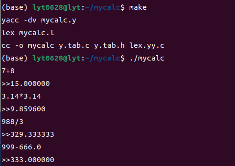

# Calc
CommandLine Caculator using Lex and yacc.

## Run
for run Calc to need to download flex and yacc
if your OS is ubuntu, run:

```shell
 apt install yacc flex
```

and run Makefile:

```shell
make
```

finally, you should get a mycalc file, run:

```shell
./mycalc
```

OK, you had run Calc


Is is my homework for the book of Making programing language by yourself written by [前桥和弥（Japanese）](http://kmaebashi.com).
## Screenshot
